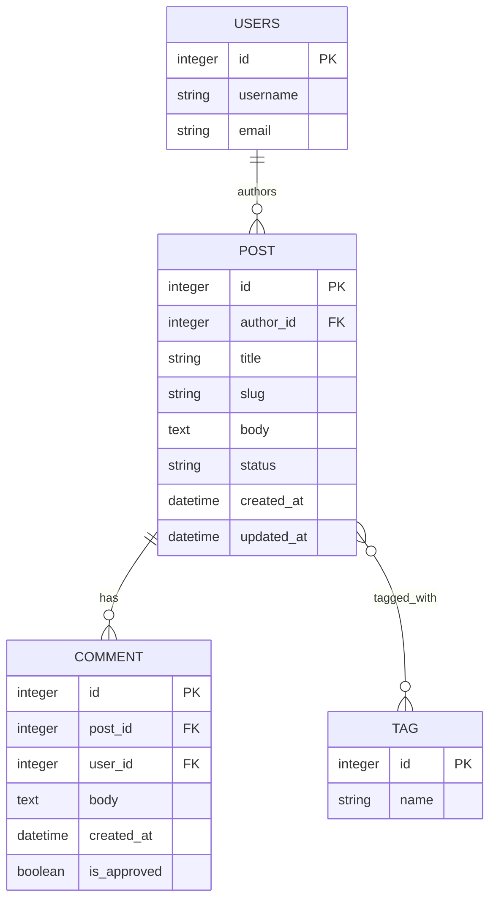

Schema diagram and notes

Mermaid ER diagram (renderable in many Markdown viewers that support Mermaid):



Notes on foreign keys and relationships
- `Post.author` is a foreign key to the project's `AUTH_USER_MODEL` (Django's User by default). Deleting a user cascades to their posts (on_delete=CASCADE).
- `Post.tags` is a ManyToMany relationship to `Tag`. The implicit join table stores `post_id` and `tag_id`.
- `Comment.post` is a FK with `related_name='comments'` so you can call `post.comments.all()`.

Migration notes (how we got here)
- The initial migration `blog/migrations/0001_initial.py` creates the `Post`, `Tag`, and `Comment` tables. Key operations performed by migrations:
  - Create `Tag` table with `id` and `name` columns.
  - Create `Post` table with `author` FK, `title`, `slug`, `body`, `status`, `created_at`, `updated_at` and `slug` is unique.
  - Create intermediary M2M table for `post_tags` (Django-managed), storing pairs of `post_id` and `tag_id`.
  - Create `Comment` table with FK to `Post` and FK to `User` and an `is_approved` boolean.

If you add future migrations (e.g., analytics counters, indexes, or soft-delete fields), follow this pattern:
- Add migration via `python manage.py makemigrations` and inspect the generated migration under `blog/migrations/`.
- When adding large data migrations (e.g., backfilling tag counts), prefer a two-step migration:
  1) schema migration to add the column (nullable or with a default), deploy, and run.
  2) data migration (management command or RunPython) that backfills values and then a follow-up migration to make the column non-nullable if desired.

Business & analytics assumptions and examples

Intended business model
- Authors publish blog posts, which go through editorial workflow states: `draft` -> `review` -> `published`.
- Tags are lightweight categories applied by authors.
- Comments are user-contributed feedback; `is_approved` allows manual moderation.

Analytics questions this schema supports
- Content production metrics:
  - Posts published per author per week/month.
  - Time spent in review (time between status `review` and `published` — requires an audit/timestamp field per status change if high fidelity is needed).
- Engagement metrics:
  - Number of comments per post and per author (approved vs. unapproved).
  - Average comments per published post.
- Tag analysis:
  - Top tags by post count (tag cloud).
  - Post counts per tag over time (trend analysis requires created_at bucketing).

Example SQL queries (simplified) you might run for analytics

- Posts per author (last 30 days):

```sql
SELECT author_id, COUNT(*) as posts_count
FROM blog_post
WHERE status = 'published' AND created_at >= DATE('now', '-30 days')
GROUP BY author_id;
```

- Top 10 tags by published posts:

```sql
SELECT t.name, COUNT(*) as cnt
FROM blog_post_tags pt
JOIN blog_tag t ON pt.tag_id = t.id
JOIN blog_post p ON pt.post_id = p.id
WHERE p.status = 'published'
GROUP BY t.name
ORDER BY cnt DESC
LIMIT 10;
```

- Average comments per published post:

```sql
SELECT AVG(c.cnt) FROM (
  SELECT p.id, COUNT(cm.id) as cnt
  FROM blog_post p
  LEFT JOIN blog_comment cm ON cm.post_id = p.id AND cm.is_approved = 1
  WHERE p.status = 'published'
  GROUP BY p.id
) c;
```

Recommended analytics additions (if analytics are a priority)
- Add timestamps for editorial transitions (e.g., `reviewed_at`, `published_at`) or a generic `status_history` table to compute time-in-review precisely.
- Add `views` counters (incremental counter column) or use an event pipeline for page views if you need detailed traffic analysis (recommend using separate analytics storage for high-volume data).
- Add an indexed `slug` column (already unique) and indexes on `status` and `created_at` for faster reporting queries.

Privacy & retention notes
- Comments are user-generated content and should be subject to retention policies if required by law/regulation. Provide an admin interface to delete or anonymize comments when necessary.
- Consider anonymizing or aggregating user-level analytics when exporting personally-identifiable trends.

If you'd like, I can also add a rendered PNG/SVG of the Mermaid diagram to the repo (I can generate a simple SVG), and wire it into `SCHEMA.md` so the diagram is visible even where Mermaid isn't supported. Would you like that? 
